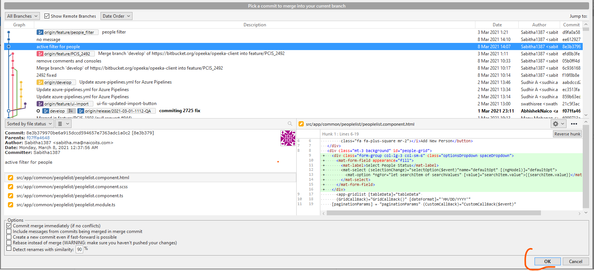

## Merging changes to develop branch

1. Checkout to the **develop** branch to which changes to be merged.
2. Click **Merge** button on top menu.
3. Then Select a **commit** that want to be merged to the **develop**.
4. Click OK.

